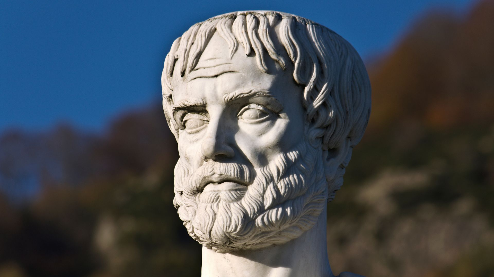
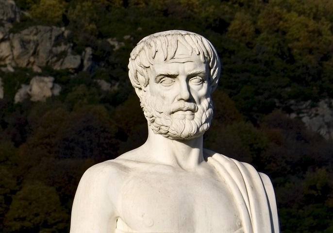

# Aristoteles: Poetik (050802)

**Inhalt**

Die aristotelische Poetik ist das Schlüsselwerk antiker Literatur- und Kunsttheorie und behielt insbesondere ihre dramentheoretische Strahlkraft über viele Jahrhunderte. Sie ist gleichzeitig eine umfangreiche Antwort auf Platons Kunstkritik und rehabilitiert die Dichtkunst als erkenntnisfördernde Praxis gegenüber der Philosophie. Darüberhinaus legt sie ästhetische Grundbegriffe fest, wie etwa Mimesis, Poesis, Drama, Katharsis und Katastrophe, die aus der ästhetischen Theorie nicht wegzudenken sind.

* Moritz Riemann [riemann@philsem.uni-kiel.de](riemann@philsem.uni-kiel.de) 

* Sprechstundentermine im Sommersemester: **xxx**  |  Boschstraße 1, R. 01.001 | **Keine Anmeldung erforderlich** | Nach Absprache auch digital oder telephonisch unter 0431 880 5644

## "Regierungserklärung"

1. Die Teilnahme am Seminar erfordert die vorbereitende, gründliche Lektüre der Texte.

2. Eine regelmäßige und aktive Teilnahme aller Seminarteilnehmenden ist Voraussetzung für ein gelingendes Seminar.
3. Philosophische Seminare leben vom diskursiven Austausch. Nehmt in Euren Diskussionsbeiträgen auf den Text und aufeinander Bezug, lasst einander ausreden und vermeidet lange, abschweifende Exkurse.
4. Meine Sprechsstunde ist offen für alle Anliegen, es ist keine Anmeldung erforderlich.
5. Bevor Ihr eine Email schreibt: Seht im Seminarplan nach, ob die gesuchte Information dort zu finden ist.

## Zuordnung und Prüfungsleistungen

**Voraussetzungen / Organisatorisches**

* PHF-phil-BA2 (Geschichte der Philosophie: Antike)
* PHF-phil-BA3 (Einführung in die theoretische Philosophie)
* PHF-phil-BA5 (Theoretische Philosophie- Vertiefung)
* PHF-phil-WP (Philosophische Reflexion und Ethische Urteilskraft)

Beachten Sie die Handreichung zum wissenschaftlichen Arbeiten im Fach Philosophie. Jedes Referat, jede Hausarbeit und jeder Essay sind im Vorfeld in der Sprechstunde abzustimmen. 

Der Abgabetermin für die schriftlichen Prüfungsleistungen ist der **XXXXX** . Die Abgabe erfolgt als Ausdruck, mit Deckblatt und unterschriebener Eigenständigkeitserklärung an der Hauptpforte oder im Briefkasten für Prüfungsleistungen in der LS4. Keine Abgabe per Email!

## Semesterplan

| **14.04.2025** | **Eröffnung, Organisatorisches** | **Referat** |
|------------|------------------------------|---------|
| 21.04.2025 | ---- |---  |
| 28.04.2025 | ---| -- |
| 05.05.2025 |  ---| -- |
| 12.05.2025 | ---| -- |
| 19.05.2025 | ---| -- |
| 26.05.2025 |---| -- |
| 02.06.2025 | ---| -- |
| 09.06.2025| ---| -- |
| 16.06.2025 | ---| -- |
| 30.06.2025 |---| -- |
| 07.07.2025| ---| -- |
| 14.07.2025| **Abschlussdiskussion** | -- |

**Prüfungszeitraum des aktuellen Semesters**:
14.07. - 26.07.2025

**2. Prüfungszeitraum**:
06.10. - 18.10.2025

**Termine für die Anmeldung zum 1. Prüfungszeitraum (1. PZ)**

* Beginn: Montag 2.06.2025
* Ende: Sonntag 29.06.2025

**Termine für die Anmeldung  zum 2. Prüfungszeitraum (2. PZ)**

* Beginn: 25.08.2025
* Ende: 21.09.2025

## 1. Sitzung am 14.04.2025

## Aristoteles

### **Allgemeine Informationen**

- **Name:** Aristoteles  

- **Lebensdaten:** 384 v. Chr. – 322 v. Chr.  

- **Geburtsort:** Stageira, Griechenland  

- **Beruf:** Philosoph, Wissenschaftler, Lehrer  

- **Schule:** Gründer des Lyzeums in Athen  

### **Philosophische Ansätze**
Aristoteles gilt als einer der bedeutendsten Philosophen der Antike und prägte zahlreiche Disziplinen:
- **Metaphysik:** Konkrete Einzeldinge sind die Substanzen der Wirklichkeit; später ergänzte er dies durch die Lehre, dass die Form die Substanz ist.
- **Ethik:** Ziel des Lebens ist das Glück (*eudaimonia*), erreichbar durch Verstandes- und Charaktertugenden sowie den richtigen Umgang mit Begierden und Emotionen.
- **Staatslehre:** Der Staat ist Voraussetzung für menschliches Glück; Aristoteles entwickelte eine Staatsformenlehre, die lange Zeit maßgeblich war.
- **Dichtungstheorie:** Die Funktion der Tragödie liegt in der Erzeugung von Furcht und Mitleid, um eine Reinigung (*Katharsis*) zu bewirken.
### **Wissenschaftliche Beiträge**
Aristoteles unterteilte Wissen in verschiedene Bereiche:
1. **Theoretische Wissenschaften:** Naturwissenschaften, Mathematik, Ontologie, Theologie und Logik.
2. **Praktische Wissenschaften:** Ethik, Politik und Rhetorik mit dem Ziel des guten Handelns.
3. **Produktive Wissenschaften:** Kunst, Landwirtschaft und Medizin mit dem Ziel des Herstellens.
### **Leben und Wirken**
- Aristoteles wurde in Stageira geboren und erhielt seine Ausbildung an Platons Akademie in Athen, wo er 20 Jahre blieb.  
- Nach Platons Tod verließ er Athen und wurde Lehrer von Alexander dem Großen.  
- Er gründete später das Lyzeum in Athen, wo er etwa 12 Jahre lehrte und forschte. Seine Schule wurde auch "Peripatos" genannt, da er oft beim Gehen unterrichtete.
### **Werke**
Aristoteles hinterließ ein umfangreiches literarisches Werk:
- Zu seinen bekanntesten Schriften zählen die *Metaphysik*, *Nikomachische Ethik*, *Politik* und *Poetik*.
- Seine Werke sind in zwei Kategorien unterteilt: 
  - **Exoterische Schriften** (für ein breites Publikum)  
  - **Esoterische Schriften** (für den internen Gebrauch seiner Schule).
### **Tod**
Aristoteles starb 322 v. Chr. eines natürlichen Todes auf dem Land, nachdem er wegen Gotteslästerung angeklagt worden war und Athen verlassen musste.

## Die wichtigsten Werke von Aristoteles
### **Logik und Wissenschaftstheorie**
- **Organon**: Sammlung logischer Schriften, die die Grundlagen der formalen Logik und Dialektik behandeln. Dazu gehören:
  - *Kategorien* (Cat.)
  - *De interpretatione* (Int.)
  - *Analytica priora* und *Analytica posteriora* (An. pr., An. post.)
  - *Topik* (Top.)
  - *Sophistische Widerlegungen* (Soph. el.).

### **Theoretische Wissenschaften**
- **Metaphysik**: Untersuchung der Prinzipien des Seins und der Wirklichkeit, oft als Ontologie bezeichnet.
- **Physik**: Schriften zur Naturphilosophie, die sich mit Veränderung, Materie und Form beschäftigen.
- **De anima**: Seelenlehre, die die Seele als Form des Körpers beschreibt.

### **Praktische Wissenschaften**
- **Nikomachische Ethik**: Analysen über Tugend, Glück und das gute Leben.
- **Politik**: Untersuchung der besten Staatsformen und des menschlichen Zusammenlebens.
- **Eudemische Ethik**: Ergänzung zur Nikomachischen Ethik mit ähnlichen Themen.

### **Poietische Wissenschaften**
- **Rhetorik**: Kunst der Überzeugung und Argumentation.
- **Poetik**: Theorie der Dichtung, insbesondere der Tragödie und ihrer Wirkung (*Katharsis*).
### **Naturwissenschaftliche Werke**
- **Historia animalium**: Zoologische Studien über Tiere und ihre Eigenschaften.
- **De generatione et corruptione**: Untersuchungen über Entstehung und Vergehen.
- **De partibus animalium** und **De generatione animalium**: Anatomische und biologische Studien.
Diese Werke bilden die Grundlage für zahlreiche Disziplinen wie Philosophie, Naturwissenschaften und Politik. Sie sind bis heute einflussreich in der akademischen Welt.

### **Literatur zu Aristoteles (Auswahl)**
- ...
- .... 

### **Aristoteles im Netz** 
- ... 
- .... 
- ... 
